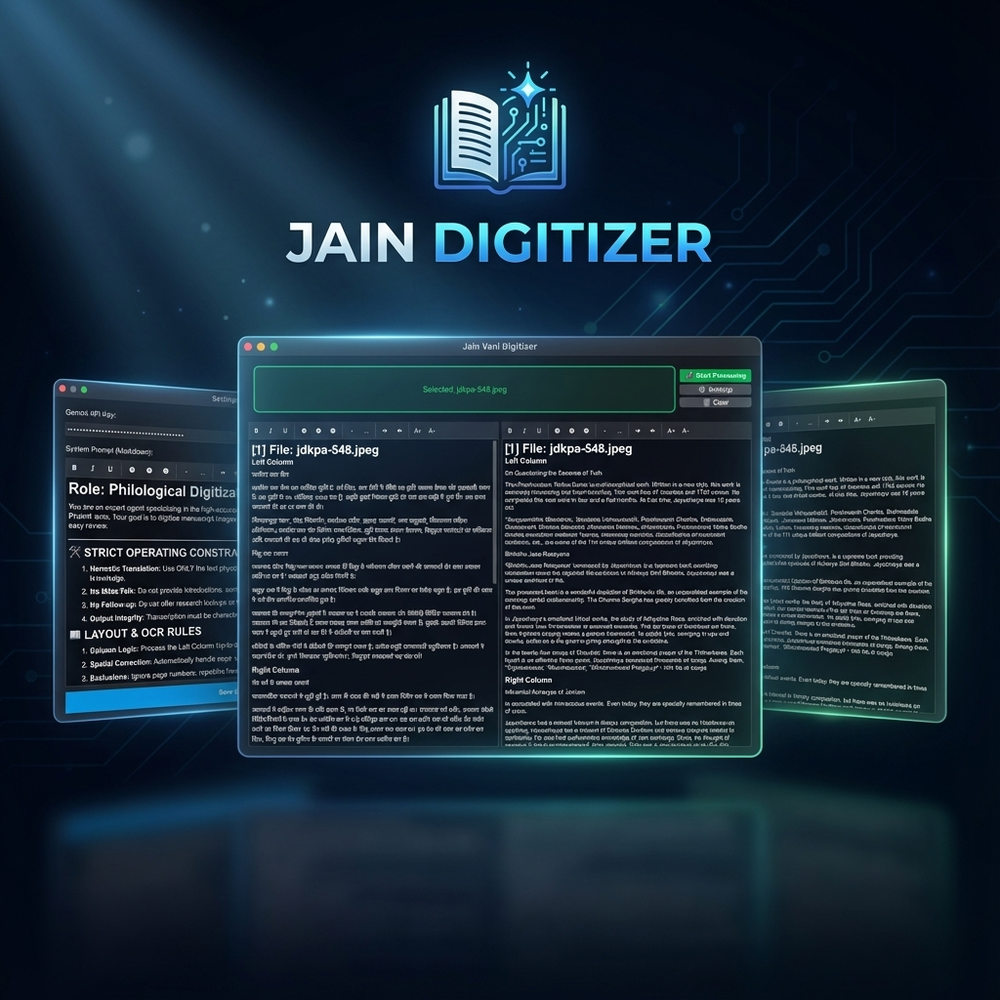

# Jain Digitizer 📚✨

[](https://github.com/yogendra/jain-digitizer/actions/workflows/release.yaml)
[](https://pypi.org/project/jain-digitizer/)
[](https://pypi.org/project/jain-digitizer/)
[](https://libraries.io/github/yogendra/jain-digitizer)
[](https://opensource.org/licenses/MIT)



Jain Digitizer is a powerful, modern desktop application designed to streamline the digitization of philological and religious texts, specifically tailored for Hindi and Jain literature. Leveraging the power of Google's Gemini 2.0 Flash API, it provides high-fidelity OCR, translation, and rich text editing in a unified workspace.

---

### 📥 [Download Latest Build](https://github.com/yogendra/jain-digitizer/releases/latest)

---

## 🚀 Quick Start

### 1. Prerequisites

- **Conda** (Miniconda or Anaconda)
- **Gemini API Key**: Obtain one from the [Google AI Studio](https://aistudio.google.com/).

### 2. Linux System Dependencies (Debian/Ubuntu)

If you are on Linux (including Raspberry Pi / aarch64), you need to install the following system libraries for the GUI and Camera to function:

```bash
sudo apt update
sudo apt install -y libxcb-cursor0 libxcb-xinerama0 libxcb-icccm4 libxcb-image0 \
    libxcb-keysyms1 libxcb-render-util0 libxcb-shape0 libxcb-xkb1 libxkbcommon-x11-0 \
    libegl1 libopengl0 gstreamer1.0-plugins-good gstreamer1.0-plugins-bad gstreamer1.0-libav
```

### 3. Installation

```bash
# Option 1: Using Pip (Recommended)
pip install jain-digitizer

# Option 2: Using Conda
conda install -c your-channel jain-digitizer
```

### 4. Configuration

1. Launch the application (see below).
2. Click the **⚙️ Settings** button.
3. Enter your **Gemini API Key**.
4. (Optional) Customize the **System Prompt** for specific translation or formatting rules.

### 5. Running the App

```bash
jain-digitizer
```

---

## 💻 Supported Platforms

The application is designed to be cross-platform and supports the following architectures:

| Operating System | Architecture             | Status                                           |
| :--------------- | :----------------------- | :----------------------------------------------- |
| **macOS**        | Apple Silicon (M1/M2/M3) | ✅ Fully Supported                               |
| **Windows**      | x86_64                   | ✅ Fully Supported                               |
| **Linux**        | x86_64                   | ✅ Fully Supported (Ubuntu, Fedora, Arch, etc.)  |
| **Linux**        | ARM64 (aarch64)          | ⚠️ Experimental (Raspberry Pi 4/5, Jetson, etc.) |

---

---

## ✨ Features

- **Intelligent OCR**: High-accuracy text extraction from PDFs and images using Gemini 2.0.
- **Batch Processing**: Drop multiple files at once for lightning-fast concurrent processing.
- **Rich Text Editor**:
  - WYSIWYG editing for Hindi and English.
  - Paste-as-Markdown support.
  - Native Trackpad **Pinch-to-Zoom** and `Ctrl+Scroll` support.
- **Centralized Logging**: Beautiful, colorized terminal output and persistent file logs for easy debugging.
- **Easy Distribution**: Packaged for Pip and Conda for seamless cross-platform usage.

---

## 🛠️ Developers

If you want to contribute to this project or run it from source, please refer to the [Developer Guide](docs/DEVELOPMENT.md).

---

## 📜 License

This project is licensed under the **MIT License**.

Copyright (c) 2025 Jain Digitizer Contributors.

Permission is hereby granted, free of charge, to any person obtaining a copy of this software and associated documentation files (the "Software"), to deal in the Software without restriction, including without limitation the rights to use, copy, modify, merge, publish, distribute, sublicense, and/or sell copies of the Software, and to permit persons to whom the Software is furnished to do so, subject to the following conditions:

The above copyright notice and this permission notice shall be included in all copies or substantial portions of the Software.

THE SOFTWARE IS PROVIDED "AS IS", WITHOUT WARRANTY OF ANY KIND, EXPRESS OR IMPLIED, INCLUDING BUT NOT LIMITED TO THE WARRANTIES OF MERCHANTABILITY, FITNESS FOR A PARTICULAR PURPOSE AND NONINFRINGEMENT. IN NO EVENT SHALL THE AUTHORS OR COPYRIGHT HOLDERS BE LIABLE FOR ANY CLAIM, DAMAGES OR OTHER LIABILITY, WHETHER IN AN ACTION OF CONTRACT, TORT OR OTHERWISE, ARISING FROM, OUT OF OR IN CONNECTION WITH THE SOFTWARE OR THE USE OR OTHER DEALINGS IN THE SOFTWARE.
