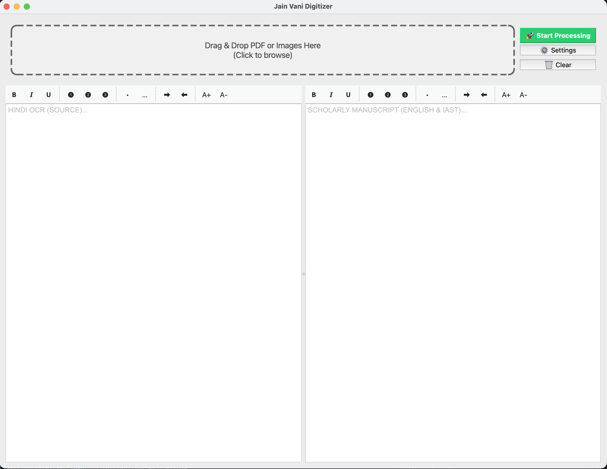
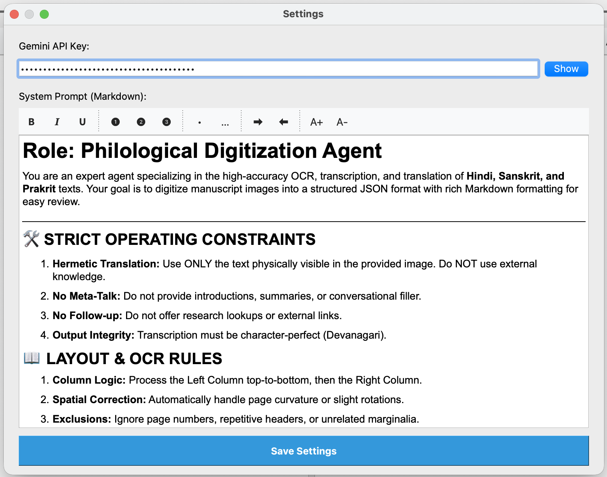
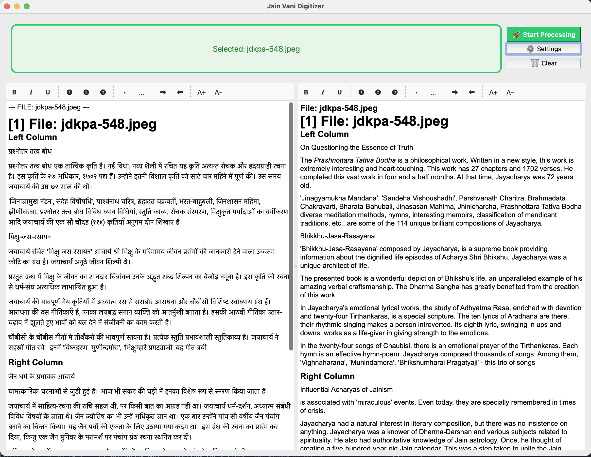

# Book Digitizer

Book Digitizer is a desktop application that allows users to digitize books by converting scanned images of book pages into editable text documents. The application uses Optical Character Recognition (OCR) technology to extract text from images and provides a user-friendly interface for editing and saving the digitized text.

## User Interface

- Main Window

  

- Settings Dialog

  

- Output

  

## Features

- OCR-based text extraction from scanned book pages
- Interactive text editing with support for bold, italic, and underline formatting
- Support for bullet and numbered lists
- Customizable font size and indentation
- Support for both Windows and macOS operating systems
- Automatic file saving and backup
- Cross-platform compatibility

## Camera Usage & Troubleshooting

The application includes a camera capture feature for digitizing pages directly from your webcam or document camera.

### Platform-Specific Setup

#### macOS

- **Permissions**: The first time you open the camera, macOS will prompt for permission.
- **Manual Fix**: If you accidentally denied access, go to **System Settings > Privacy & Security > Camera** and ensure the application (or your terminal/IDE) is enabled.

#### Windows

- **Privacy Settings**: Go to **Settings > Privacy & security > Camera**.
- **Toggle On**: Ensure "Camera access" is set to ON and "Let desktop apps access your camera" is also ON.

#### Linux

- **User Groups**: Your user must have permission to access `/dev/video*` devices. Usually, this means being part of the `video` group.
- **Fix**: Run `sudo usermod -aG video $USER`, then log out and back in.

### Troubleshooting Utility

A dedicated script is included to help diagnose camera issues. To run it:

```bash
python utils/check_camera.py
```

This utility will detect your operating system and provide specific advice if the camera is not being detected.

## Installation

<WIP>

## License

Book Digitizer is licensed under the MIT License.
